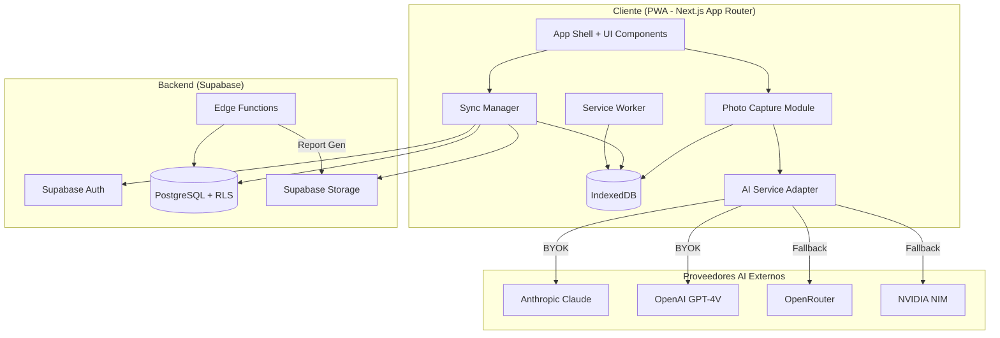
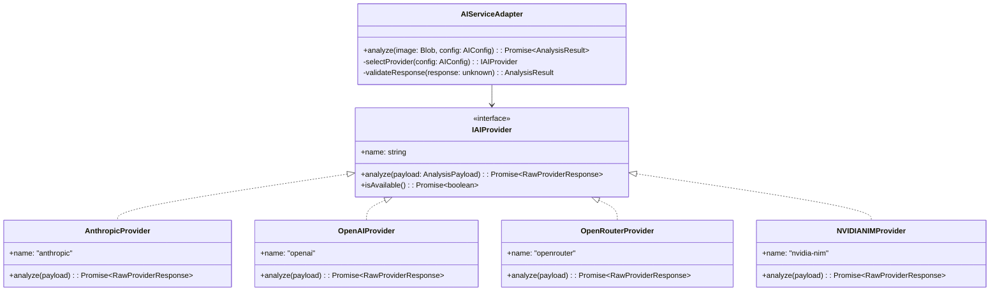
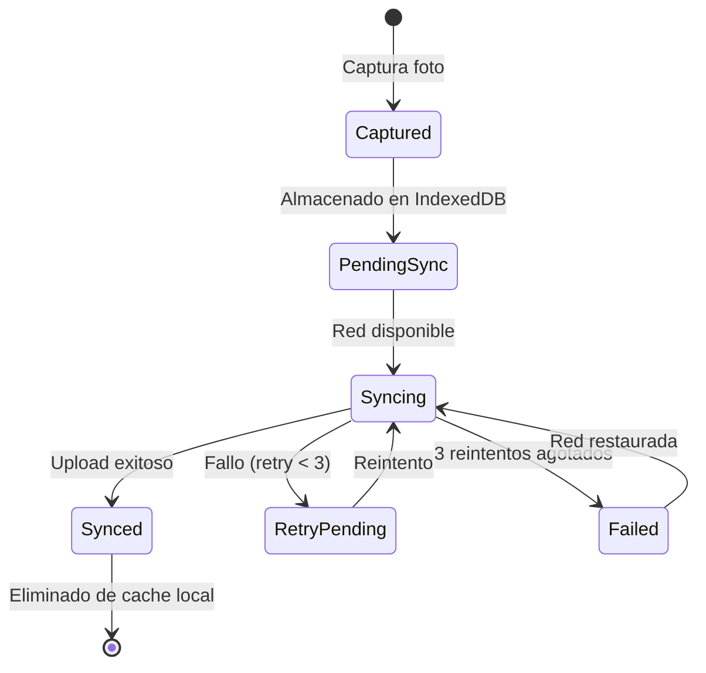
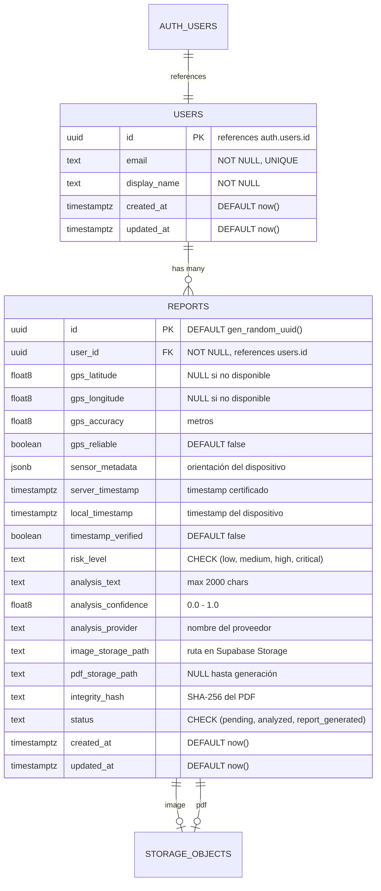
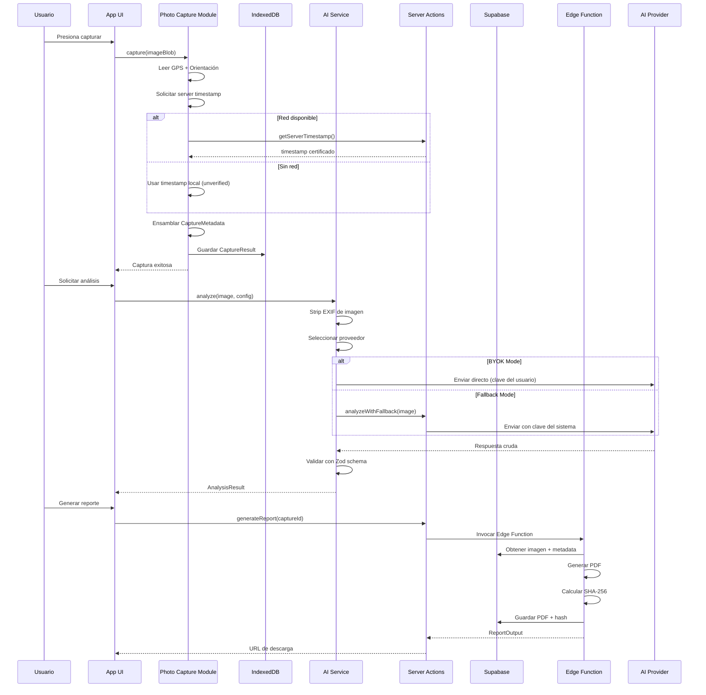
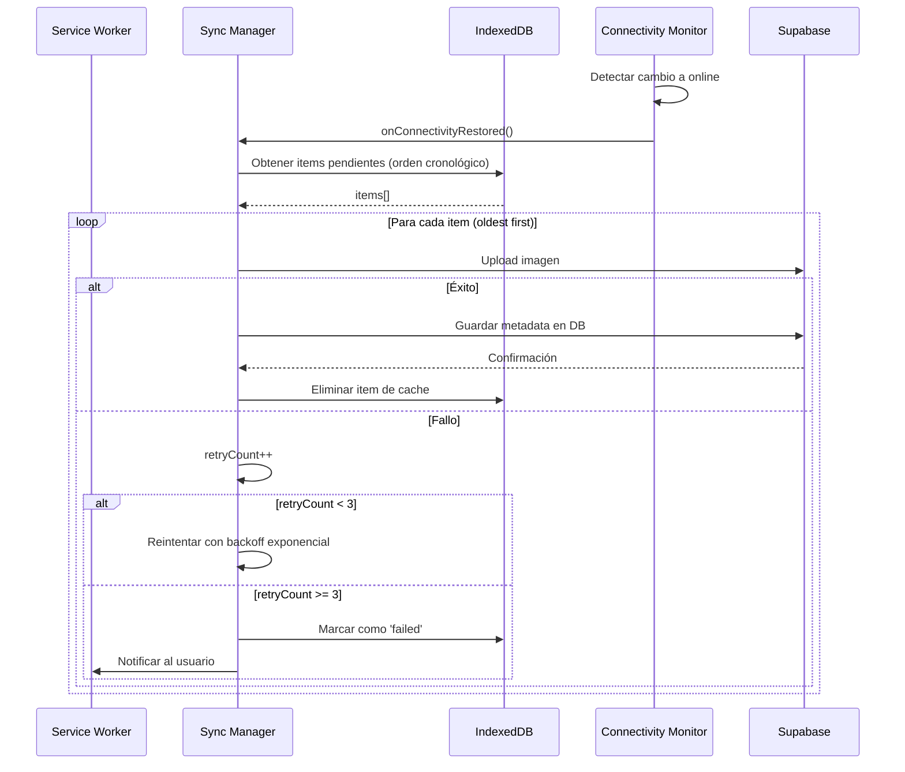

# Documento de Diseño Técnico

## Overview

Earthquake Crack Triage PWA es una aplicación web progresiva diseñada para triaje de grietas post-sismo en Cali, Colombia. El sistema permite a ciudadanos documentar daños estructurales con metadatos legalmente relevantes (GPS, timestamps certificados, ángulos del dispositivo) y obtener análisis preliminar de riesgo asistido por IA. Los reportes generados son inmutables y verificables mediante hash de integridad, sirviendo como documentación de soporte para autoridades de gestión del riesgo y aseguradoras.

La arquitectura sigue un enfoque **offline-first** con sincronización eventual, reconociendo que la conectividad es intermitente en zonas de desastre. El diseño prioriza:

1. **Zero-friction**: Acceso inmediato vía enlace web, sin tiendas de aplicaciones
2. **Resiliencia offline**: Captura y almacenamiento local completo sin red
3. **Validez legal**: Metadatos certificados y reportes inmutables con hash de integridad
4. **Modularidad AI**: Adaptador desacoplado que soporta BYOK y modo fallback público

## Architecture

### Diagrama de Arquitectura de Alto Nivel



### Patrón Arquitectónico

La aplicación implementa una **arquitectura en capas con sincronización eventual**:

| Capa | Responsabilidad | Tecnología |
|------|-----------------|------------|
| Presentación | UI reactiva, captura de fotos, indicadores de estado | Next.js App Router + Tailwind CSS |
| Servicio | Lógica de negocio, orquestación AI, validación | Server Actions + AI Service Adapter |
| Persistencia Local | Cache offline, cola de sincronización | IndexedDB + Service Worker |
| Persistencia Remota | Almacenamiento definitivo, RLS, integridad | Supabase PostgreSQL + Storage |
| Generación de Reportes | PDF inmutable con hash de integridad | Supabase Edge Functions |

### Decisiones Arquitectónicas Clave

1. **Next.js App Router sobre Pages Router**: Permite Server Components para reducir JavaScript del cliente, streaming SSR, y Server Actions para mutaciones tipo-seguras sin API routes explícitas.

2. **Supabase como BaaS completo**: Unifica auth, base de datos, storage y edge functions en un solo proveedor, reduciendo complejidad operativa en contexto de emergencia.

3. **AI Service Adapter en cliente (BYOK) y servidor (Fallback)**: Las claves BYOK nunca tocan el backend; las llamadas fallback pasan por Server Actions para proteger claves del sistema.

4. **IndexedDB sobre localStorage**: Soporta almacenamiento estructurado de blobs binarios (imágenes) con capacidad significativamente mayor (~50MB+ vs 5MB).

5. **Service Worker con estrategia Cache-First para shell, Network-First para datos**: El shell se sirve instantáneamente desde cache; los datos se sincronizan cuando hay red.

## Components and Interfaces

### 1. Photo Capture Module (`lib/capture/`)

Responsable de orquestar la captura de imagen con todos los metadatos de sensores.

```typescript
// lib/capture/types.ts
interface CaptureMetadata {
  id: string;                          // UUID v4 generado en cliente
  timestamp: {
    local: string;                     // ISO 8601
    server: string | null;             // ISO 8601, null si pendiente
    verified: boolean;                 // true si timestamp es certificado
  };
  gps: {
    latitude: number | null;           // 6 decimales mínimo
    longitude: number | null;
    accuracy: number | null;           // metros
    available: boolean;
    reliable: boolean;                 // true si accuracy <= 50m
  };
  orientation: {
    alpha: number | null;              // 0-360 grados
    beta: number | null;               // -180 a 180
    gamma: number | null;              // -90 a 90
    available: boolean;
  };
  deviceInfo: {
    userAgent: string;
    platform: string;
  };
}

interface CaptureResult {
  id: string;
  imageBlob: Blob;
  metadata: CaptureMetadata;
  status: 'pending_sync' | 'synced' | 'failed';
  retryCount: number;
  createdAt: string;                   // ISO 8601
}
```

```typescript
// lib/capture/captureService.ts
interface ICaptureService {
  capture(imageBlob: Blob): Promise<CaptureResult>;
  getServerTimestamp(): Promise<string>;
  getCurrentPosition(): Promise<GeolocationPosition | null>;
  getDeviceOrientation(): DeviceOrientationData | null;
}
```

### 2. AI Service Adapter (`lib/ai/`)

Implementa el patrón Strategy con un router que selecciona el proveedor según la configuración del usuario.



```typescript
// lib/ai/types.ts
type RiskLevel = 'low' | 'medium' | 'high' | 'critical';

interface AnalysisResult {
  riskLevel: RiskLevel;
  description: string;                 // max 2000 chars
  confidence: number;                  // 0.0 - 1.0
  provider: string;                    // nombre del proveedor que respondió
  analyzedAt: string;                  // ISO 8601
}

interface AIConfig {
  mode: 'byok' | 'fallback';
  byok?: {
    provider: 'anthropic' | 'openai';
    apiKey: string;                     // encriptada en memoria del navegador
  };
  fallbackPriority: string[];          // e.g., ['openrouter', 'nvidia-nim']
}

interface AnalysisPayload {
  image: Buffer;                        // imagen sin EXIF
  prompt: string;                       // prompt de análisis estructural
  maxTokens: number;
}

interface IAIProvider {
  name: string;
  analyze(payload: AnalysisPayload): Promise<RawProviderResponse>;
  isAvailable(): Promise<boolean>;
}
```

```typescript
// lib/ai/aiService.ts
interface IAIServiceAdapter {
  analyze(image: Blob, config: AIConfig): Promise<AnalysisResult>;
  registerProvider(provider: IAIProvider): void;
  getAvailableProviders(): string[];
}
```

### 3. Report Generator Edge Function (`supabase/functions/generate-report/`)

Se ejecuta como Supabase Edge Function (Deno runtime). Genera PDFs inmutables con hash de integridad.

```typescript
// supabase/functions/generate-report/types.ts
interface ReportInput {
  captureId: string;
  userId: string;
  imageStoragePath: string;
  metadata: CaptureMetadata;
  analysis: AnalysisResult;
}

interface ReportOutput {
  reportId: string;
  pdfStoragePath: string;
  integrityHash: string;               // SHA-256
  downloadUrl: string;                  // URL firmada, accesible solo al owner
  generatedAt: string;                  // ISO 8601
}
```

### 4. Offline-First Sync Manager (`lib/sync/`)

Gestiona la cola de sincronización entre IndexedDB y Supabase.



```typescript
// lib/sync/types.ts
type SyncStatus = 'pending' | 'syncing' | 'synced' | 'failed';

interface SyncQueueItem {
  id: string;
  captureResult: CaptureResult;
  status: SyncStatus;
  retryCount: number;
  lastAttempt: string | null;
  error: string | null;
  createdAt: string;
}

interface ISyncManager {
  enqueue(capture: CaptureResult): Promise<void>;
  processQueue(): Promise<SyncResult[]>;
  getQueueStatus(): Promise<QueueStatus>;
  getQueueCount(): Promise<number>;
  removeItem(id: string): Promise<void>;
  retryFailed(): Promise<void>;
}

interface QueueStatus {
  pending: number;
  syncing: number;
  failed: number;
  total: number;
  isFull: boolean;                     // true si total >= 50
}
```

### 5. Connectivity Monitor (`lib/connectivity/`)

Observa el estado de red y coordina la sincronización.

```typescript
// lib/connectivity/types.ts
type ConnectivityState = 'online' | 'offline' | 'syncing';

interface IConnectivityMonitor {
  getState(): ConnectivityState;
  subscribe(callback: (state: ConnectivityState) => void): () => void;
  checkConnectivity(): Promise<boolean>;
}
```

## Data Models

### Esquema de Base de Datos (PostgreSQL)



### SQL de Migración

```sql
-- Tabla de usuarios
CREATE TABLE public.users (
    id UUID PRIMARY KEY REFERENCES auth.users(id) ON DELETE CASCADE,
    email TEXT NOT NULL UNIQUE,
    display_name TEXT NOT NULL,
    created_at TIMESTAMPTZ NOT NULL DEFAULT now(),
    updated_at TIMESTAMPTZ NOT NULL DEFAULT now()
);

-- Tabla de reportes
CREATE TABLE public.reports (
    id UUID PRIMARY KEY DEFAULT gen_random_uuid(),
    user_id UUID NOT NULL REFERENCES public.users(id) ON DELETE CASCADE,
    gps_latitude DOUBLE PRECISION,
    gps_longitude DOUBLE PRECISION,
    gps_accuracy DOUBLE PRECISION,
    gps_reliable BOOLEAN DEFAULT false,
    sensor_metadata JSONB DEFAULT '{}'::jsonb,
    server_timestamp TIMESTAMPTZ,
    local_timestamp TIMESTAMPTZ NOT NULL,
    timestamp_verified BOOLEAN DEFAULT false,
    risk_level TEXT NOT NULL CHECK (risk_level IN ('low', 'medium', 'high', 'critical')),
    analysis_text TEXT NOT NULL CHECK (char_length(analysis_text) <= 2000),
    analysis_confidence DOUBLE PRECISION CHECK (analysis_confidence >= 0 AND analysis_confidence <= 1),
    analysis_provider TEXT NOT NULL,
    image_storage_path TEXT NOT NULL,
    pdf_storage_path TEXT,
    integrity_hash TEXT,
    status TEXT NOT NULL DEFAULT 'pending' CHECK (status IN ('pending', 'analyzed', 'report_generated')),
    created_at TIMESTAMPTZ NOT NULL DEFAULT now(),
    updated_at TIMESTAMPTZ NOT NULL DEFAULT now()
);

-- Índices
CREATE INDEX idx_reports_user_id ON public.reports(user_id);
CREATE INDEX idx_reports_status ON public.reports(status);
CREATE INDEX idx_reports_created_at ON public.reports(created_at DESC);
CREATE INDEX idx_reports_risk_level ON public.reports(risk_level);
```

### Políticas RLS

```sql
-- Habilitar RLS
ALTER TABLE public.users ENABLE ROW LEVEL SECURITY;
ALTER TABLE public.reports ENABLE ROW LEVEL SECURITY;

-- Políticas para tabla users
CREATE POLICY "users_select_own"
    ON public.users FOR SELECT
    USING (id = auth.uid());

CREATE POLICY "users_insert_own"
    ON public.users FOR INSERT
    WITH CHECK (id = auth.uid());

CREATE POLICY "users_update_own"
    ON public.users FOR UPDATE
    USING (id = auth.uid())
    WITH CHECK (id = auth.uid());

-- Políticas para tabla reports
CREATE POLICY "reports_select_own"
    ON public.reports FOR SELECT
    USING (user_id = auth.uid());

CREATE POLICY "reports_insert_own"
    ON public.reports FOR INSERT
    WITH CHECK (user_id = auth.uid());

CREATE POLICY "reports_update_own"
    ON public.reports FOR UPDATE
    USING (user_id = auth.uid())
    WITH CHECK (user_id = auth.uid());

CREATE POLICY "reports_delete_own"
    ON public.reports FOR DELETE
    USING (user_id = auth.uid());
```

### Políticas de Storage Buckets

```sql
-- Bucket para imágenes de capturas
INSERT INTO storage.buckets (id, name, public)
VALUES ('captures', 'captures', false);

-- Bucket para PDFs de reportes
INSERT INTO storage.buckets (id, name, public)
VALUES ('reports', 'reports', false);

-- Política: usuario solo accede a sus propios archivos
CREATE POLICY "captures_user_access"
    ON storage.objects FOR ALL
    USING (bucket_id = 'captures' AND (storage.foldername(name))[1] = auth.uid()::text)
    WITH CHECK (bucket_id = 'captures' AND (storage.foldername(name))[1] = auth.uid()::text);

CREATE POLICY "reports_user_access"
    ON storage.objects FOR ALL
    USING (bucket_id = 'reports' AND (storage.foldername(name))[1] = auth.uid()::text)
    WITH CHECK (bucket_id = 'reports' AND (storage.foldername(name))[1] = auth.uid()::text);

-- Edge Functions acceden via service_role (bypass RLS)
```

### Esquema IndexedDB (Local)

```typescript
// lib/db/localSchema.ts
interface LocalDBSchema {
  captures: {
    key: string;                       // UUID
    value: {
      id: string;
      imageBlob: Blob;
      metadata: CaptureMetadata;
      analysisResult: AnalysisResult | null;
      syncStatus: SyncStatus;
      retryCount: number;
      lastAttempt: string | null;
      error: string | null;
      createdAt: string;
    };
    indexes: {
      'by-status': SyncStatus;
      'by-created': string;
    };
  };
  settings: {
    key: string;
    value: {
      aiConfig: AIConfig;
      lastSyncAt: string | null;
    };
  };
}
```

## Flujo de Datos

### Flujo Principal: Captura → Análisis → Reporte



### Flujo de Sincronización Offline



## Diseño de API

### Server Actions (Next.js)

```typescript
// app/actions/timestamp.ts
'use server'
export async function getServerTimestamp(): Promise<{
  timestamp: string;
  source: 'server';
}>;

// app/actions/sync.ts
'use server'
export async function syncCapture(data: {
  imageBase64: string;
  metadata: CaptureMetadata;
  analysisResult: AnalysisResult;
}): Promise<{
  success: boolean;
  reportId: string;
  imageStoragePath: string;
}>;

// app/actions/analysis.ts
'use server'
export async function analyzeWithFallback(data: {
  imageBase64: string;
}): Promise<AnalysisResult>;

// app/actions/report.ts
'use server'
export async function generateReport(data: {
  captureId: string;
}): Promise<ReportOutput>;
```

### Supabase Edge Function

```typescript
// supabase/functions/generate-report/index.ts
// POST /functions/v1/generate-report
// Headers: Authorization: Bearer <service_role_key>
// Body: ReportInput
// Response: ReportOutput | ErrorResponse
```

### Esquemas de Validación Zod

```typescript
// lib/validation/schemas.ts
import { z } from 'zod';

export const riskLevelSchema = z.enum(['low', 'medium', 'high', 'critical']);

export const analysisResultSchema = z.object({
  riskLevel: riskLevelSchema,
  description: z.string().max(2000),
  confidence: z.number().min(0).max(1),
  provider: z.string(),
  analyzedAt: z.string().datetime(),
});

export const captureMetadataSchema = z.object({
  id: z.string().uuid(),
  timestamp: z.object({
    local: z.string().datetime(),
    server: z.string().datetime().nullable(),
    verified: z.boolean(),
  }),
  gps: z.object({
    latitude: z.number().min(-90).max(90).nullable(),
    longitude: z.number().min(-180).max(180).nullable(),
    accuracy: z.number().positive().nullable(),
    available: z.boolean(),
    reliable: z.boolean(),
  }),
  orientation: z.object({
    alpha: z.number().min(0).max(360).nullable(),
    beta: z.number().min(-180).max(180).nullable(),
    gamma: z.number().min(-90).max(90).nullable(),
    available: z.boolean(),
  }),
  deviceInfo: z.object({
    userAgent: z.string().max(1024),
    platform: z.string().max(255),
  }),
});

export const fileNameSchema = z.string()
  .max(255)
  .transform((val) => val.replace(/[^a-zA-Z0-9\-_.]/g, ''))
  .refine((val) => val.length > 0, 'File name cannot be empty after sanitization');

export const syncPayloadSchema = z.object({
  imageBase64: z.string().max(10 * 1024 * 1024 * 1.37), // ~10MB in base64
  metadata: captureMetadataSchema,
  analysisResult: analysisResultSchema,
});
```

## Consideraciones de Seguridad

### Protección de Claves API

| Clave | Almacenamiento | Acceso |
|-------|---------------|--------|
| Supabase Anon Key | Variable de entorno `NEXT_PUBLIC_SUPABASE_ANON_KEY` | Cliente (solo lectura pública) |
| Supabase Service Role | Variable de entorno `SUPABASE_SERVICE_ROLE_KEY` | Solo servidor (Server Actions / Edge Functions) |
| Claves BYOK del usuario | `sessionStorage` encriptada con Web Crypto API | Solo navegador del usuario, nunca sale al backend |
| Claves fallback AI | Variable de entorno servidor | Solo Server Actions |

### Estrategia de Encriptación BYOK

Las claves BYOK se encriptan en el navegador usando Web Crypto API con AES-GCM:
- Se genera una clave de encriptación derivada del session token del usuario
- La clave API encriptada se almacena en `sessionStorage`
- Al cerrar sesión o pestaña, la clave desaparece
- Las llamadas BYOK se hacen directamente desde el cliente al proveedor AI (no pasan por nuestro backend)

### Sanitización y Validación

1. **Boundary validation**: Todos los inputs se validan con Zod en el punto de entrada (Server Action o API route)
2. **File name sanitization**: Solo caracteres `[a-zA-Z0-9\-_.]`, máximo 255 caracteres
3. **Metadata truncation**: Strings limitados a 1024 caracteres antes de persistir
4. **EXIF stripping**: Las imágenes se procesan con `piexifjs` para eliminar metadatos EXIF antes de enviar a proveedores AI
5. **SQL injection**: Prevenido por Supabase client library (parameterized queries)
6. **XSS**: Next.js escapa contenido por defecto en RSC; inputs renderizados se sanitizan

### Protección de Privacidad

- GPS coordinates: Nunca expuestos en endpoints públicos; protegidos por RLS
- PII exclusion: El payload enviado a proveedores AI contiene SOLO la imagen (sin EXIF) y el prompt de análisis
- Report sharing: El PDF solo incluye datos que el usuario explícitamente selecciona para compartir
- Storage isolation: Cada usuario tiene su propio "folder" en Storage (`{user_id}/filename`)

### Errores Seguros

Las respuestas de error siguen un formato estructurado que nunca expone:
- Stack traces
- Rutas de archivos del servidor
- Identificadores internos de base de datos
- Nombres de servicios internos
- Detalles de configuración

```typescript
// lib/errors/types.ts
interface SafeErrorResponse {
  error: {
    code: string;                      // e.g., 'VALIDATION_ERROR', 'UPLOAD_FAILED'
    message: string;                   // mensaje descriptivo para el usuario
    fields?: Record<string, string>;   // errores a nivel de campo
  };
}
```

## Correctness Properties

*Una propiedad es una característica o comportamiento que debe mantenerse verdadero a través de todas las ejecuciones válidas de un sistema — esencialmente, una declaración formal sobre lo que el sistema debe hacer. Las propiedades sirven como puente entre especificaciones legibles por humanos y garantías de correctitud verificables por máquina.*

### Property 1: Invariante de Capacidad del Cache Offline

*Para cualquier* secuencia de capturas de fotos mientras el dispositivo está offline, el sistema debe almacenar cada captura en IndexedDB con todos sus metadatos asociados, permitir hasta exactamente 50 items pendientes, y rechazar nuevas capturas cuando el límite se alcanza — sin pérdida de datos en items previamente almacenados.

**Validates: Requirements 1.3, 4.3, 4.7, 12.2**

### Property 2: Retención tras Agotamiento de Reintentos

*Para cualquier* item de sincronización que falla en sus 3 intentos de reintento, el sistema debe retener el item completo (imagen + metadatos) en la cola local, marcarlo como fallido, y reencolarlo para sincronización en el próximo evento de restauración de conectividad — nunca eliminarlo de la cola.

**Validates: Requirements 1.5, 4.6, 12.7**

### Property 3: Integridad de Metadatos GPS

*Para cualquier* lectura GPS con precisión horizontal reportada, si la precisión es <= 50 metros, el sistema debe almacenar las coordenadas con mínimo 6 decimales de precisión y marcarlas como confiables; si la precisión excede 50 metros o GPS no está disponible, el sistema debe permitir la captura, marcar las coordenadas como no confiables o no disponibles, y nunca almacenar coordenadas con flag `reliable: true`.

**Validates: Requirements 2.1, 2.5**

### Property 4: Fallback de Certificación de Timestamp

*Para cualquier* evento de captura donde el servidor no está disponible o el timeout de 5 segundos se excede, el sistema debe registrar el timestamp local marcado como `verified: false`, y encolar una solicitud de certificación de servidor para la próxima sincronización — nunca marcar un timestamp local como verificado.

**Validates: Requirements 2.4**

### Property 5: Límites de Validación de Contraseña

*Para cualquier* string de contraseña, si su longitud es menor a 8 caracteres o mayor a 128 caracteres, el sistema debe rechazar el registro; si la longitud está entre 8 y 128 caracteres (inclusive), el sistema no debe rechazar por longitud.

**Validates: Requirements 3.1**

### Property 6: Aislamiento a Nivel de Fila (RLS)

*Para cualquier* par de usuarios (A, B) donde A != B, el usuario A no debe poder leer, modificar, ni eliminar reportes o datos de perfil pertenecientes al usuario B; y cualquier intento de INSERT en la tabla reports con `user_id` diferente al `auth.uid()` del usuario autenticado debe ser rechazado.

**Validates: Requirements 3.3, 11.4, 11.5, 11.6**

### Property 7: Respuestas de Error Seguras

*Para cualquier* error de validación o fallo del sistema, la respuesta de error retornada al usuario no debe contener stack traces, rutas de archivos del servidor, identificadores internos de base de datos, ni nombres de servicios internos — solo un código de error, mensaje descriptivo para el usuario, y opcionalmente errores a nivel de campo.

**Validates: Requirements 3.5, 9.4**

### Property 8: Completitud de Persistencia de Metadatos

*Para cualquier* foto exitosamente subida al backend (Supabase Storage devuelve confirmación de éxito), el sistema debe persistir TODOS los campos de metadatos asociados (coordenadas GPS si disponibles, sensor metadata, timestamps, Risk_Level, texto de análisis) en la base de datos PostgreSQL como un registro completo.

**Validates: Requirements 4.2**

### Property 9: Limpieza de Cache tras Confirmación

*Para cualquier* item en el cache local que recibe una confirmación de éxito del backend de Supabase, ese item debe ser eliminado del IndexedDB local — nunca debe persistir un item ya sincronizado exitosamente.

**Validates: Requirements 4.4**

### Property 10: Exclusión de Datos Sensibles

*Para cualquier* request enviado a proveedores AI externos, el payload no debe contener: claves API BYOK del usuario en requests al backend propio, información personal identificable (nombre, email, teléfono), coordenadas GPS, ni metadatos EXIF de la imagen. Los logs del sistema no deben contener claves API ni datos de imagen.

**Validates: Requirements 5.1, 7.5, 10.1, 10.3, 10.5**

### Property 11: Validación de Schema de Respuesta AI

*Para cualquier* respuesta de proveedor AI (BYOK o Fallback), el sistema debe validarla contra el Zod schema esperado. Si la respuesta conforma al schema, debe producir un `AnalysisResult` válido con Risk_Level en {low, medium, high, critical}, descripción de max 2000 caracteres, y confianza entre 0.0 y 1.0. Si no conforma, debe rechazarla, retornar error estructurado, y nunca pasar datos inválidos al resto del sistema.

**Validates: Requirements 5.3, 5.6, 6.5, 7.3, 7.4**

### Property 12: Cadena de Failover de Proveedores

*Para cualquier* secuencia de fallos de proveedores fallback (timeout > 15s o rate-limit), el sistema debe intentar el siguiente proveedor en orden de prioridad configurado, sin repetir un proveedor ya fallido en la misma cadena, hasta agotar todos los proveedores disponibles.

**Validates: Requirements 6.3**

### Property 13: Enrutamiento de Proveedor por Presencia de Clave

*Para cualquier* solicitud de análisis AI, si existe una clave API de usuario configurada (BYOK), el sistema debe enrutar al proveedor BYOK seleccionado; si no existe clave configurada, debe enrutar al modo Fallback. La decisión de enrutamiento es determinista y depende exclusivamente de la presencia/ausencia de la clave.

**Validates: Requirements 7.2**

### Property 14: Contrato de Interfaz del Adaptador AI

*Para cualquier* proveedor registrado en el AI Service Adapter, el resultado de `analyze()` debe conformar a la interfaz: contener Risk_Level (uno de exactamente 4 valores), descripción (máximo 2000 caracteres), y un indicador de confianza numérico. Payloads de imagen no deben exceder 10 MB.

**Validates: Requirements 7.1**

### Property 15: Completitud de Contenido del Reporte

*Para cualquier* solicitud de generación de reporte, si todos los campos requeridos están presentes (foto, timestamp certificado, Risk_Level, texto de análisis), el PDF generado debe contener todos esos campos. Si algún campo requerido falta, el sistema debe retornar un error listando exactamente los campos faltantes y no producir un reporte parcial.

**Validates: Requirements 8.1, 8.5**

### Property 16: Hash de Integridad del Reporte

*Para cualquier* PDF generado por el Report_Generator, el Integrity_Hash (SHA-256) embebido en el footer del PDF debe ser igual al hash calculado independientemente sobre el contenido binario del PDF (excluyendo la sección del hash mismo). La verificación de hash debe ser reproducible por cualquier herramienta SHA-256 estándar.

**Validates: Requirements 8.2**

### Property 17: Sanitización de Inputs

*Para cualquier* string de entrada como nombre de archivo, después de sanitización debe contener exclusivamente caracteres `[a-zA-Z0-9\-_.]` y tener longitud max 255. Si la sanitización produce un string vacío, la solicitud debe ser rechazada con error indicando el campo específico. Strings de metadatos deben ser truncados a máximo 1024 caracteres antes de almacenamiento.

**Validates: Requirements 9.1, 9.3, 9.5**

### Property 18: Orden Cronológico de Sincronización

*Para cualquier* conjunto de items pendientes en la cola de sincronización, cuando la sincronización se inicia, los items deben procesarse en orden cronológico ascendente (el más antiguo primero). Ningún item más nuevo debe sincronizarse antes que uno más antiguo que esté listo para sincronización.

**Validates: Requirements 12.3**

### Property 19: Preservación en Resolución de Conflictos

*Para cualquier* conflicto de sincronización (datos en servidor más nuevos que datos locales), el sistema debe preservar AMBAS versiones (local y servidor) sin pérdida de datos, y marcar cada item en conflicto con un indicador visual distinguible de items sin conflicto.

**Validates: Requirements 12.5**

## Error Handling

### Estrategia General

El sistema implementa un enfoque de **graceful degradation** donde cada componente puede operar con funcionalidad reducida:

| Escenario de Fallo | Comportamiento | Recuperación |
|---------------------|---------------|--------------|
| Sin red | Cache offline, captura continúa | Sync automático al restaurar |
| GPS no disponible | Captura sin ubicación, flag visual | Metadata parcial en reporte |
| Orientación no disponible | Captura sin ángulos | Campos marcados N/A en reporte |
| Server timestamp timeout | Timestamp local (unverified) | Re-certificación en sync |
| AI provider timeout (BYOK) | Notificación + oferta switch a fallback | Usuario decide |
| Todos los fallback fallan | Mensaje + almacenar para retry | Retry automático en 15 min |
| Storage upload falla 3x | Retener en local, notificar | Retry en siguiente cambio de red |
| PDF generation timeout | Error 408, no genera parcial | Usuario puede reintentar |
| Zod validation falla | Rechazo + error estructurado | Usuario corrige input |
| Storage quota excedida | Bloquear captura, notificar | Usuario sincroniza o libera espacio |

### Patrones de Retry

```typescript
// lib/retry/config.ts
interface RetryConfig {
  maxAttempts: 3;
  backoffStrategy: 'exponential';
  baseDelay: 1000;        // 1s, 2s, 4s
  maxDelay: 30000;        // cap at 30s
  timeoutPerAttempt: 30000;
}
```

### Logging Seguro

Los logs del sistema registran: proveedor seleccionado, resultado (éxito/fallo con categoría de error), duración, timestamp. Nunca registran: claves API, datos de imagen, coordenadas GPS, información personal.

## Testing Strategy

### Enfoque Dual: Tests Unitarios + Tests de Propiedades

La estrategia de testing combina:

1. **Tests de propiedades (property-based testing)**: Verifican invariantes universales que deben cumplirse para TODOS los inputs válidos. Usan generación aleatoria de datos para explorar el espacio de inputs.

2. **Tests unitarios (example-based)**: Verifican comportamientos específicos, edge cases, e integraciones con servicios externos.

3. **Tests de integración**: Verifican la comunicación con Supabase (auth, storage, database, edge functions).

4. **Tests E2E**: Verifican flujos completos del usuario en un navegador real.

### Stack de Testing

| Tipo | Herramienta | Configuración |
|------|-------------|---------------|
| Unit + Property | Vitest + fast-check | Mínimo 100 iteraciones por propiedad |
| Integration | Vitest + Supabase local (Docker) | Against real PostgreSQL |
| E2E | Playwright | Chrome mobile viewport |
| Visual Regression | Playwright screenshots | Comparación pixel-level |

### Librería de Property-Based Testing

Se utiliza **fast-check** para Vitest:
- Cada test de propiedad ejecuta mínimo 100 iteraciones
- Cada test referencia la propiedad del diseño que valida
- Formato de tag: **Feature: earthquake-crack-triage-pwa, Property {N}: {título}**
- Los generadores (Arbitraries) se diseñan para cubrir edge cases (strings vacíos, unicode, valores límite)

### Organización de Tests

```
tests/
├── properties/          # Tests de propiedades (PBT)
│   ├── cache.prop.ts
│   ├── sync.prop.ts
│   ├── gps.prop.ts
│   ├── ai-service.prop.ts
│   ├── sanitization.prop.ts
│   ├── rls.prop.ts
│   ├── report.prop.ts
│   └── privacy.prop.ts
├── unit/                # Tests unitarios
│   ├── capture/
│   ├── ai/
│   ├── sync/
│   └── validation/
├── integration/         # Tests de integración
│   ├── supabase/
│   └── ai-providers/
└── e2e/                 # Tests end-to-end
    ├── capture.spec.ts
    ├── analysis.spec.ts
    └── report.spec.ts
```

## Stack Tecnológico

### Decisiones y Justificaciones

| Componente | Tecnología | Justificación |
|------------|------------|---------------|
| Framework | Next.js 14+ (App Router) | Server Components reducen JS del cliente; Server Actions simplifican mutaciones; excelente soporte PWA |
| Styling | Tailwind CSS | Utility-first ideal para mobile-first; purge elimina CSS no usado; excelente DX |
| PWA | next-pwa / Serwist | Integración nativa con Next.js; genera SW automáticamente; precache configurable |
| Base de datos | Supabase PostgreSQL | RLS nativo; realtime subscriptions para sync; client SDK tipo-seguro |
| Auth | Supabase Auth | Email/password + magic link out-of-the-box; JWT con refresh automático; session management |
| Storage | Supabase Storage | Buckets privados con RLS; URLs firmadas; integración directa con Edge Functions |
| Edge Functions | Supabase Edge Functions (Deno) | Acceso directo a DB y Storage; PDF generation server-side; trusted timestamps |
| Validación | Zod | Type-safe schema validation; integración con TypeScript; inference de tipos |
| IndexedDB | idb (wrapper) | Promise-based API sobre IndexedDB; typed schemas; migrations |
| PDF Generation | @react-pdf/renderer o jsPDF | Server-side rendering de PDFs; embebido de imágenes y metadata |
| EXIF Removal | piexifjs | Lightweight; funciona en browser y servidor |
| Crypto | Web Crypto API + Node crypto | AES-GCM para encriptación BYOK; SHA-256 para integrity hash |
| PBT | fast-check | Madurez, integración con Vitest, excelentes shrinking y arbitraries |
| Testing | Vitest + Playwright | Fast unit tests; browser-based E2E |
| Linting | ESLint + Prettier | Consistencia de código |

### Estructura de Archivos del Proyecto

```
src/
├── app/                            # Next.js App Router
│   ├── (auth)/                     # Rutas de autenticación
│   │   ├── login/page.tsx
│   │   ├── register/page.tsx
│   │   └── layout.tsx
│   ├── (protected)/                # Rutas protegidas
│   │   ├── capture/page.tsx
│   │   ├── reports/page.tsx
│   │   ├── reports/[id]/page.tsx
│   │   └── settings/page.tsx
│   ├── actions/                    # Server Actions
│   │   ├── timestamp.ts
│   │   ├── sync.ts
│   │   ├── analysis.ts
│   │   └── report.ts
│   ├── layout.tsx
│   ├── page.tsx
│   └── manifest.ts                 # PWA manifest
├── lib/
│   ├── ai/                         # AI Service Adapter
│   │   ├── aiService.ts
│   │   ├── providers/
│   │   │   ├── anthropic.ts
│   │   │   ├── openai.ts
│   │   │   ├── openrouter.ts
│   │   │   └── nvidia-nim.ts
│   │   ├── types.ts
│   │   └── schemas.ts
│   ├── capture/                    # Photo Capture Module
│   │   ├── captureService.ts
│   │   ├── gps.ts
│   │   ├── orientation.ts
│   │   ├── timestamp.ts
│   │   └── types.ts
│   ├── sync/                       # Sync Manager
│   │   ├── syncManager.ts
│   │   ├── queue.ts
│   │   └── types.ts
│   ├── connectivity/               # Connectivity Monitor
│   │   ├── monitor.ts
│   │   └── types.ts
│   ├── db/                         # Database & Local Storage
│   │   ├── supabase.ts             # Supabase client
│   │   ├── localDb.ts             # IndexedDB wrapper
│   │   └── localSchema.ts
│   ├── validation/                 # Zod schemas
│   │   ├── schemas.ts
│   │   └── sanitize.ts
│   ├── errors/                     # Error handling
│   │   ├── types.ts
│   │   └── formatError.ts
│   ├── crypto/                     # Encryption utilities
│   │   ├── byokEncryption.ts
│   │   └── integrityHash.ts
│   └── exif/                       # EXIF processing
│       └── strip.ts
├── components/                     # UI Components
│   ├── capture/
│   ├── reports/
│   ├── sync/
│   ├── auth/
│   └── ui/                         # Shared UI primitives
├── hooks/                          # Custom React hooks
│   ├── useCapture.ts
│   ├── useSync.ts
│   ├── useConnectivity.ts
│   └── useAIAnalysis.ts
├── public/
│   ├── sw.js                       # Service Worker (generated)
│   └── icons/
└── supabase/
    ├── functions/
    │   └── generate-report/
    │       ├── index.ts
    │       └── types.ts
    └── migrations/
        ├── 001_create_users.sql
        ├── 002_create_reports.sql
        ├── 003_enable_rls.sql
        └── 004_create_storage_buckets.sql
```
